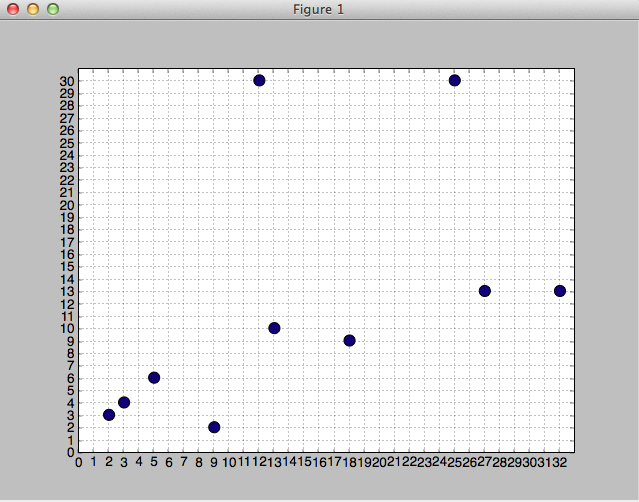

Closest-Pair-of-Points-Algorithm---Animated
===========================================

Python implementation of closest pair of points algorithm with animated graph.

Usage
=====

 Run `python closest_pair.py ArraySize` for animated version.
 Run `python closest_pair_plain.py ArraySize` for regular version.
 Run `python brute_force.py ArraySize` for brute force solution of the problem.

 ArraySize 1 and 2 for cpp algorithms are pre-defined arrays. 
 If you put another integer, it will create a random array of size ArraySize

Screenshots
===========

www.gokhanarik.com
